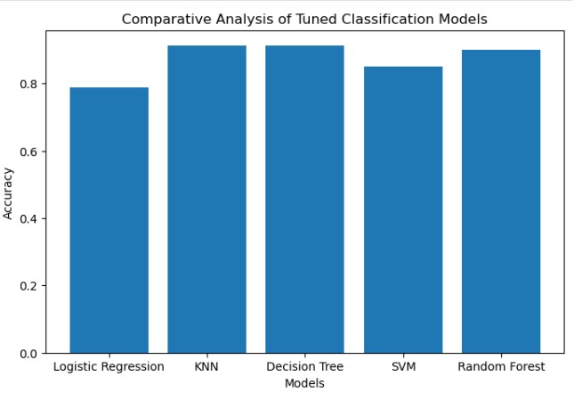
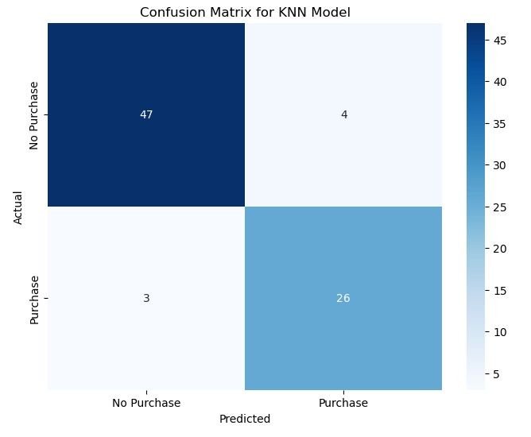
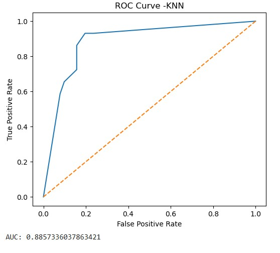
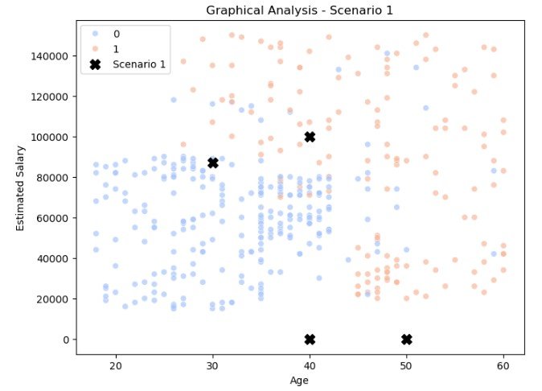
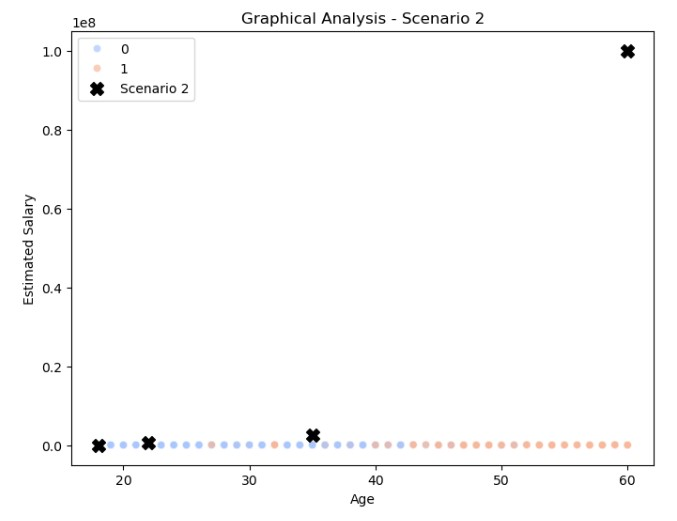

# Customer Purchase Prediction

## Overview
This project predicts whether a customer will purchase insurance based on Age and Estimated Salary using machine learning classification algorithms.

## Dataset
Features used:
- Age
- EstimatedSalary
- Purchased (Target variable)

## Algorithms Used
- Logistic Regression
- K-Nearest Neighbors (KNN)
- Support Vector Machine (SVM)
- Decision Tree
- Random Forest

## Best Model
**K-Nearest Neighbors (KNN)** achieved the highest accuracy and was selected as the best-performing model.

## Technologies
Python, Pandas, NumPy, Scikit-Learn, Matplotlib, Seaborn, Jupyter Notebook

## Applications
- Insurance customer targeting
- Financial product recommendation

## Model Evaluation
### Model Accuracy Comparison

### Confusion Matrix (KNN)

### ROC Curve

### Scenario Analysis

